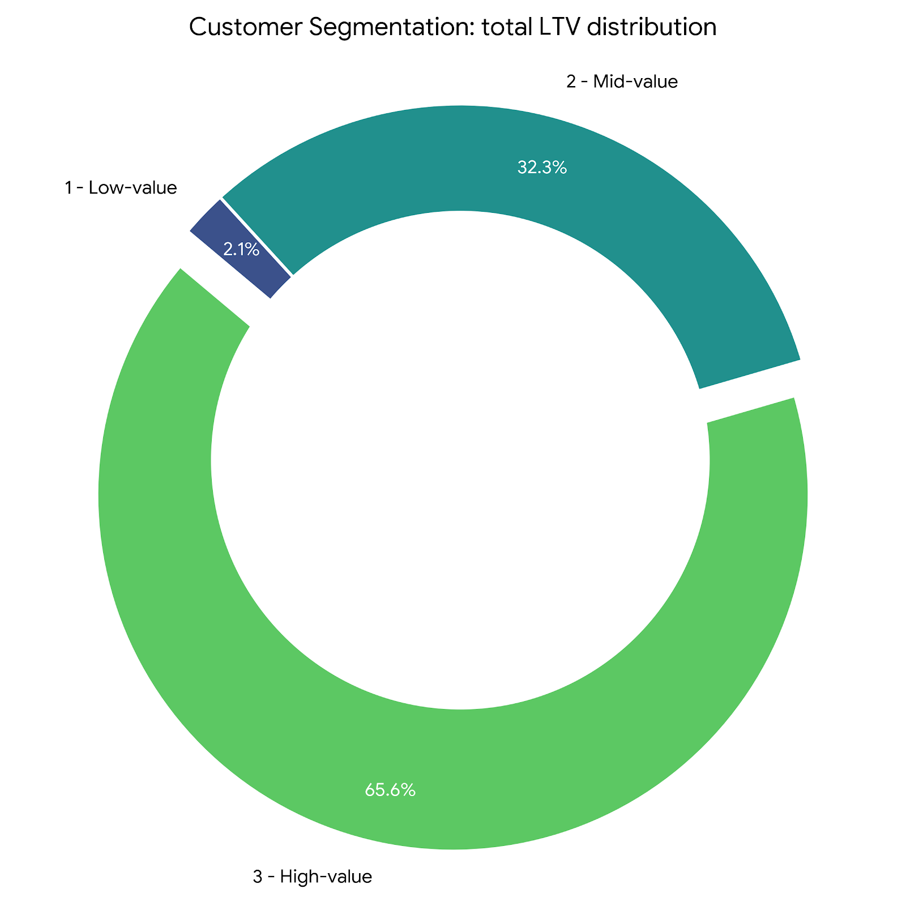
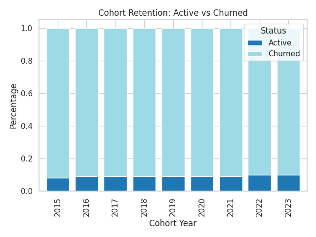

# Intermediate SQL - Sales Analysis

## Overview

Analysis of customer behavior, retention, and lifetime value for an e-commerce company using the Contoso dataset. This repository contains SQL queries and supporting data to explore customer segmentation, cohort performance, and retention patterns.

---

## Business Questions

1. Customer Segmentation: Who are our most valuable customers?
2. Cohort Analysis: How do different customer cohorts generate revenue over time?
3. Retention Analysis: Which customers are at risk of churn and how long do customers stay active?

---

## Analysis Approach

### 1. Customer Segmentation Analysis 🔍

- Categorize customers by lifetime value (LTV) and assign segments (High / Mid / Low).
- Compute key metrics: total revenue, average order value, purchase frequency by segment.

Query: [customer segmentation](01_customer_segmentation.sql)

Visualization:

*Note: sample visualization generated from `Extracted_data/01_customer_segmentation.csv`.*

---

**Key Findings:**

- **High-value** segment (25% of customers — **12,372**) drives **~65.6%** of total revenue (~**$135.4M**).
- **Mid-value** segment (50% — **24,743**) contributes **~32.3%** of revenue (~**$66.6M**).
- **Low-value** segment (25% — **12,372**) contributes **~2.1%** of revenue (~**$4.34M**).
- Average LTV by segment: **High ≈ $10,946**, **Mid ≈ $2,693**, **Low ≈ $351**.

**Business Insights:**

- **Prioritize high-LTV customers** with VIP/loyalty programs and personalized retention offers — they deliver the majority of revenue. ✅
- **Upsell and upgrade mid-value customers** through targeted promotions to move them into the high-value tier (large upside given size of mid segment). 🔧
- **Re-engage and optimize offers for low-value customers** with price-sensitive and frequency-driving campaigns to improve purchase behavior. 💡

> Notes: Update the findings section after running `01_customer_segmentation.sql` on your database to include segment sizes and revenue shares.

---

### 2. Cohort Analysis 🧭

- Track revenue and customer counts grouped by cohort (e.g., by year or month of first purchase).
- Measure retention and average revenue per customer across cohorts.

Query: [Cohort_Analysis](02_cohort_analysis.sql)

Visualization:

*Note: sample visualization generated from `Extracted_data/02_cohort_analysis.csv`.*

---

**Key Findings:**

- **Revenue per customer peaked** around 2016–2017 (~**$2.9k** per customer) and has **declined in recent cohorts**.  
- Mean revenue per customer for **2015–2019 ≈ $2,776** vs **2020–2024 ≈ $2,289**, a **~18% decline** in per-customer value for newer cohorts.
- **2022** had the **largest customer base** (9,010) and high total revenue (~**$21.5M**), but **lower revenue per customer (~$2,387**), indicating growth in customer count without commensurate per-customer value.

**Business Insights:**

- **Investigate acquisition channels and product mix** for 2020–2024 cohorts to understand why per-customer value is falling (e.g., cheaper customers, promotions, channel shifts). 🔎
- **Stabilize revenue via loyalty/subscription offers** and targeted retention incentives for weaker cohorts. 🔧
- **Target re-engagement campaigns** to cohorts with falling per-customer revenue to recover value and test acquisition optimizations. 💡

> Notes: Cohort-level trends can highlight whether newer customers are less valuable or declining in retention.

---

### 3. Customer Retention Analysis 💼

- Identify customers at risk of churn using last-purchase dates and recency metrics.
- Calculate cohort churn and long-term retention patterns.

Query: [Retention_Analysis](03_Retention_Analysis.sql)

Visualization:

*Note: sample visualization generated from `Extracted_data/03_retention_analysis.csv`.*

---

**Key Findings:**

- **Retention is low**: cohorts show **~8–10% active** customers and **~90% churn** long-term across cohorts. 🔻
- Recent cohorts (2022–2023) show **~10% active**, slightly better but still low overall.

**Business Insights:**

- **Improve early-stage engagement (first 1–2 years)** with onboarding incentives, loyalty rewards, and timely communication to raise long-term retention. ✅
- **Prioritize win-back strategies for high-value churned customers** (higher ROI than broad reactivation). 🔧
- **Implement churn prediction and early intervention** for at-risk customers to reduce long-run churn rates. 💡

> Notes: Use segmentation + retention insights to prioritize reactivation and loyalty strategies.

---

## Strategic Recommendations ✨

- Customer Value Optimization: consider loyalty/VIP programs for high-LTV customers and personalized offers to move mid-value customers up.
- Cohort Performance: investigate drivers behind weaker-performing cohorts and replicate tactics from stronger cohorts.
- Retention & Churn Prevention: strengthen early engagement, targeted win-back campaigns for high-value churned customers, and predictive churn monitoring.

---

## Technical Details 🛠️

- Database: PostgreSQL (Contoso dataset provided in `contoso_100k_DB/contoso_100k.sql`)
- Tools: PostgreSQL, DBeaver / pgAdmin or any SQL client
- Visualizations: any charting tool; placeholder images are in `images/` if present

---

## Files & Structure

- `00_create_view.sql` — helper to create a view used by later analyses (if applicable)
- `01_customer_segmentation.sql` — segmentation queries
- `02_cohort_analysis.sql` — cohort analysis queries
- `03_Retention_Analysis.sql` — retention & churn queries
- `contoso_100k_DB/contoso_100k.sql` — dataset dump (load into PostgreSQL)
- `Extracted_data/` — CSV exports from queries
- `images/` — visualizations referenced in the report

---

## How to run

1. Load `contoso_100k.sql` into your PostgreSQL instance (e.g., using psql or a DB GUI).
2. Open and run the queries in a SQL client (DBeaver, pgAdmin, etc.).
3. Export results to `Extracted_data/` and create visualizations in your preferred tool.

---

## About

This project is built to demonstrate advanced analytical queries for sales and customer analysis. Update the findings and visuals with your results from the dataset.

---

## License & Contact

This repository is intended for learning and demonstration. For questions or feedback, add an issue or contact the repository owner.
